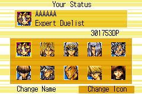
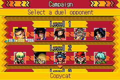
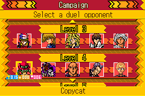
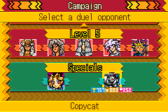
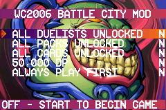
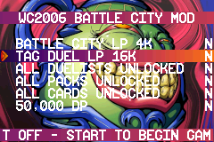

# WCT2006BATTLECITY
A revamped Yu-Gi-Oh! WCT 2006 hack featuring 25 Battle City characters, competitive real-world decks, custom portraits, and the Huge Revolution patch for an upgraded dueling experience 🔥 🎮
# Yu-Gi-Oh! WCT 2006 - Battle City Hack

## Features
- **25 Battle City Characters** – Includes most main and side duelists from the Battle City arc.
- **Optimized Decks** – Characters have **meta-competitive** decks instead of anime-accurate ones.
- **Custom Player Select Portraits** – Generic portraits have been replaced with character portraits.
- **Huge Revolution Patch Included** – Ensures 100% completion
- **New In Build Cheat Engine** - Collect all cards unlock all dualists and packs direckly using builtin cheat engine
- **LP SELECTOR** - Now select your LP for duels 4000LP for ANIME BATTLE CITY STYLE , 16000LP for TAG STYLE and default 8000LP

## Duelist Roster
This hack features **all major Battle City duelists**, including:
- **Yami Yugi**
- **Seto Kaiba**
- **Joey Wheeler**
- **Marik Ishtar**
- **Bakura (Yami)**
- **Rare Hunters**
- **Side Characters** – Includes Mako, Weevil, Esper Roba, and more!

## Installation
To play this hack, apply the patch to a clean **Yu-Gi-Oh! - Ultimate Masters - World Championship Tournament 2006 (USA) (En,Ja,Fr,De,Es,It)** ROM using a patching tool such as **Lunar IPS** or other online patchers [Here](https://www.marcrobledo.com/RomPatcher.js/).

**Download** patch from releases section or [Here](https://github.com/aishwarya25252/WCT2006BATTLECITY/releases/download/v1.0.2/WCT2006BATTLECITY_WITHCHEATENGINE_LPSELECTOR.ups).

## Credits
**Scrub Butsa** for his resources on hacking and this game , checkout his channels [channel1](https://www.youtube.com/@ScrubBusta) [channel2](https://www.youtube.com/@scrubbusted)

**Growlanser** for designing the charecter decks and playtesting them , checkout his discord server [Here](https://discord.gg/5DUeNA7wmE)

🚀 Enjoy dueling in the ultimate **Battle City experience** on GBA!

## Screen Shots

